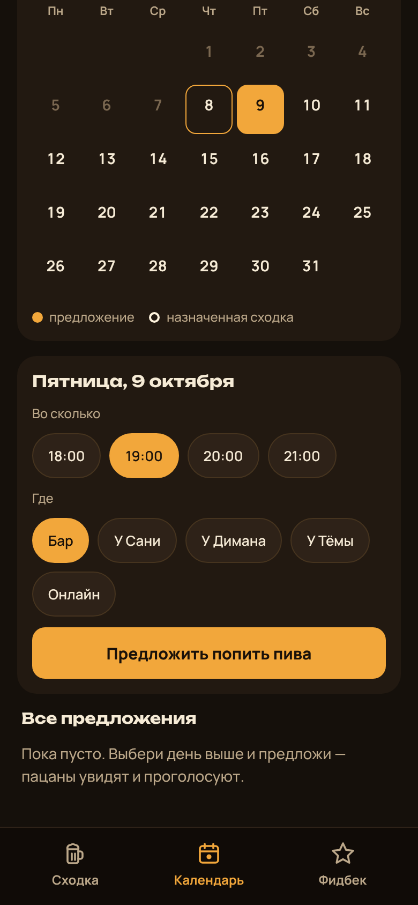

# Cuj Audit — CUJ-001 Собрать пятничный пивнаж

## Executive summary

0/1 journeys passed, 0 skipped, 0 of 6 steps verified. Journey CUJ-001 broke at step 1:
after tapping Friday in «Календарь» the screen offers only time and place, while the journey
expects place, time, beer, «покрепче», food and plus-ones. The journey stopped there; steps
2–6 and the success criteria were not observed.

| Severity | Count |
|----------|-------|
| sev4 | 0 |
| sev3 | 1 |
| sev2 | 0 |
| sev1 | 0 |

## Prioritized fixes

1. [sev3] [CUJ-001 step 1 — choosing a day offers only time and place](#sev3-cuj-001-step-1--choosing-a-day-offers-only-time-and-place)

## Findings

### [sev3] CUJ-001 step 1 — choosing a day offers only time and place

- **Issue Description:** Journey CUJ-001 "Собрать пятничный пивнаж" — step 1. Expected (verbatim): «На экране выбор места, времени, пива, «покрепче», еды и плюсов (дополнительных людей)». Observed: the day card «Пятница, 9 октября» lists only «Во сколько» (18:00, 19:00, 20:00, 21:00), «Где» (Бар, У Сани, У Димана, У Тёмы, Онлайн) and the button «Предложить попить пива». No beer, «покрепче», food or plus-one controls appear on this screen.
- **Framework Violation:** cuj-contract — step 1 `expect` not met; task-completion — the actor cannot make the journey's choices at this step.
- **Severity:** 3 — classified 3 (workaround exists only in part: beer and food can be set later on the «Сходка» tab, «покрепче» and plus-ones exist nowhere in the app); clamped by criticality `high` (uncapped) → 3.
- **Evidence:**  — controls read from the rendered card: `["Во сколько","18:00","19:00","20:00","21:00","Где","Бар","У Сани","У Димана","У Тёмы","Онлайн","Предложить попить пива"]`. Repro: open app → «Кто ты?» → Саня → «Календарь» → tap 9.
- **Recommended Fix:** When a day is tapped, open one sheet with place (with bar name and address, or whose home and address), time, beer, «покрепче», food and plus-ones, ending in the button the journey names. Also blocks: steps 2–6 of this journey (not observed).

## Walkthrough

### Step 1 — Саня в «Календаре» нажимает на эту пятницу

> Expected: выбор места, времени, пива, «покрепче», еды и плюсов. Observed: only time and place, plus «Предложить попить пива».

## Appendix

- Mode: live — headless Chromium at 390×844 (mobile, touch) against the repo build `app/src/main/assets/www/index.html`, identical to the deployed web version.
- Frameworks applied: cuj-contract, task-completion. success-criteria not applied — the journey stopped at step 1, so criteria were never reached.
- CUJ manifest: selected CUJ-001 (1 journey). Steps verified: none passed. Step 1 failed. Steps not observed: 2, 3, 4, 5, 6. Success criteria: not evaluated.
- Preconditions: L0 baseline observed on «Календарь» as Саня — day cell «9 октября» present with no proposal marker, «Все предложения» list empty (0 rows), no banner shown. Precondition «installed for Саня, Диман and Тёма» was represented by one device switching identity on «Кто ты?»; only Саня's identity was used before the journey broke.
- Coverage / not inspected: the shared Supabase base was not reachable from the audit sandbox, so cross-device sync (steps 3–6) could not have been observed live even had step 1 passed; notifications (step 3) were not inspected; the Android APK build was not run on a device.
