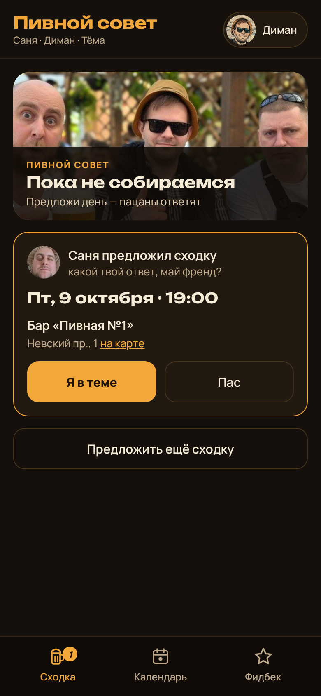
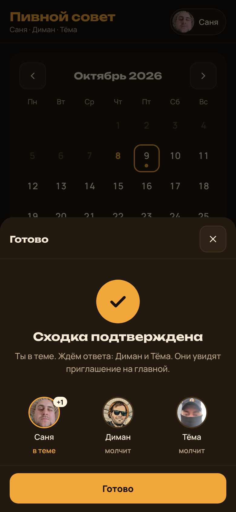

# Cuj Audit — CUJ-001 Собрать пятничный пивнаж (re-run after redesign)

## Executive summary

0/1 journeys passed, 0 skipped, 2 of 6 steps verified. Steps 1 and 2 now pass: tapping Friday
opens one sheet with place, time, beer, «покрепче», food and plus-ones, and «Подтвердить сходку»
shows «Сходка подтверждена». The journey broke at step 3: Диман and Тёма see the invitation
only when they open the app themselves; nothing arrives on their phones. Steps 4–6 and the
success criteria were not graded.

| Severity | Count |
|----------|-------|
| sev4 | 0 |
| sev3 | 1 |
| sev2 | 0 |
| sev1 | 0 |

## Prioritized fixes

1. [sev3] [CUJ-001 step 3 — invitation is not delivered as a notification](#sev3-cuj-001-step-3--invitation-is-not-delivered-as-a-notification)

## Findings

### [sev3] CUJ-001 step 3 — invitation is not delivered as a notification

- **Issue Description:** Journey CUJ-001 "Собрать пятничный пивнаж" — step 3. Expected (verbatim): «Им приходит уведомление с текстом вроде «Саня предложил сходку — какой твой ответ, май френд?»». Observed: no notification is sent to Диман's or Тёма's phone. When Диман opens the app on his own, the «Сходка» tab carries a badge «1» and the home screen shows a card reading «Саня предложил сходку / какой твой ответ, май френд? / Пт, 9 октября · 19:00 / Бар «Пивная №1» / Невский пр., 1» with «Я в теме» and «Пас». The text matches; the delivery does not.
- **Framework Violation:** cuj-contract — step 3 `expect` («приходит уведомление») not met; task-completion — friends learn about the proposal only if they open the app or are told outside it.
- **Severity:** 3 — classified 3 (workaround: Саня tells them in a chat, then the in-app invitation works); clamped by criticality `high` (uncapped) → 3.
- **Evidence:**  — in-app card text read from the render: `Саня предложил сходку какой твой ответ, май френд? Пт, 9 октября · 19:00 Бар «Пивная №1» Невский пр., 1 на карте Я в теме Пас`; tab badge `1`. Source: the app has no push or system-notification code path (`app/src/main/assets/www/index.html`, `MainActivity.java`).
- **Recommended Fix:** Deliver the invitation as a phone notification: Android — a background check against the shared base with a local notification; iPhone home-screen app — Web Push from a small server function triggered when a proposal is created.

## Walkthrough

### Step 1 — Саня в «Календаре» нажимает на эту пятницу

> Expected: выбор места, времени, пива, «покрепче», еды и плюсов. Observed: match — sheet «Сходка · Пт, 9 октября» with sections `Где, Во сколько, Пиво, Покрепче, Еда, Плюсы`; bar name and address fields appear after picking «Бар».

### Step 2 — Саня нажимает «Подтвердить сходку»

> Expected: экран «Сходка подтверждена». Observed: match — «Сходка подтверждена», «Ты в теме. Ждём ответа: Диман и Тёма. Они увидят приглашение на главной.»

### Step 3 — Диман и Тёма получают уведомление о сходке

> Expected: приходит уведомление «Саня предложил сходку — какой твой ответ, май френд?». Observed: no notification; the same text appears only inside the app when it is opened.

## Appendix

- Mode: live — headless Chromium at 390×844 (mobile, touch), three separate browser contexts for Саня, Диман and Тёма, against the repo build `app/src/main/assets/www/index.html` (commit fcdbe49, the same build deployed to the web version and APK 1.2).
- Shared base: the real Supabase base is unreachable from the audit sandbox, so the three contexts shared an in-memory stand-in for the `docs` table with the same select/upsert/delete calls. Real cross-device sync was therefore not observed by this run.
- Frameworks applied: cuj-contract, task-completion. success-criteria not applied — the journey stopped at step 3.
- CUJ manifest: selected CUJ-001 (1 journey). Steps verified: 1, 2. Step 3 failed. Steps not observed (not graded): 4, 5, 6. Success criteria: not evaluated.
- Preconditions: L0 baseline — each context started with empty storage; «Календарь» as Саня showed no proposal on 9 October; identities set on «Кто ты?» (Саня, Диман, Тёма), one per context.
- Coverage / not inspected: steps 4–6 and the success criterion were not graded under the stop-at-first-failure rule; the Android APK and the iPhone home-screen app were not run on devices; real Supabase sync not observed.
